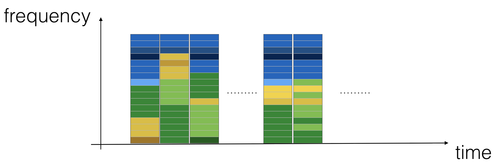
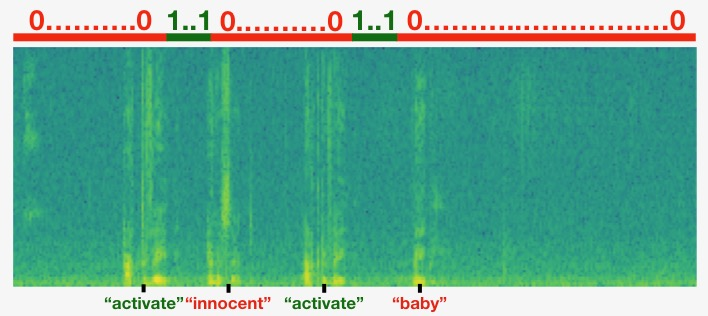

## Trigger Word Detection

Welcome to the second and last programming assignment of Week 3! 

In this week's videos, you learned about applying deep learning to speech recognition. In this assignment, you will construct a speech dataset and implement an algorithm for trigger word detection (sometimes also called keyword detection, or wake word detection). 

* Trigger word detection is the technology that allows devices like Amazon Alexa, Google Home, Apple Siri, and Baidu DuerOS to wake up upon hearing a certain word.  
* For this exercise, our trigger word will be "activate". Every time it hears you say "activate", it will make a "chiming" sound. 
* By the end of this assignment, you will be able to record a clip of yourself talking, and have the algorithm trigger a chime when it detects you saying "activate". 
* After completing this assignment, perhaps you can also extend it to run on your laptop so that every time you say "activate" it starts up your favorite app, or turns on a network connected lamp in your house, or triggers some other event? 


In this project you will learn to: 
- Structure a speech recognition project
- Synthesize and process audio recordings to create train/dev datasets
- Train a trigger word detection model and make predictions

Let's get started!

## Trigger Word Detection
 

We will construct a speech dataset and implement an algorithm for trigger word detection (sometimes also called keyword detection, or wake word detection). 

* Trigger word detection is the technology that allows devices like Amazon Alexa, Google Home, Apple Siri, and Baidu DuerOS to wake up upon hearing a certain word.  
* For this exercise, our trigger word will be "activate". Every time it hears you say "activate", it will make a "chiming" sound. 
* By the end of this assignment, you will be able to record a clip of yourself talking, and have the algorithm trigger a chime when it detects you saying "activate". 
* After completing this assignment, perhaps you can also extend it to run on your laptop so that every time you say "activate" it starts up your favorite app, or turns on a network connected lamp in your house, or triggers some other event? 


In this assignment you will learn to: 
- Structure a speech recognition project
- Synthesize and process audio recordings to create train/dev datasets
- Train a trigger word detection model and make predictions

Let's get started!


If you do any of the following, you will get something like, `Grader not found` (or similarly unexpected) error upon submitting your assignment. Before asking for help/debugging the errors in your assignment, check for these first. If this is the case, and you don't remember the changes you have made, you can get a fresh copy of the assignment by following these [instructions](https://www.coursera.org/learn/nlp-sequence-models/supplement/qHIve/h-ow-to-refresh-your-workspace).

<a name='1'></a>
## 1 - Data synthesis: Creating a Speech Dataset 

Let's start by building a dataset for your trigger word detection algorithm. 
* A speech dataset should ideally be as close as possible to the application you will want to run it on. 
* In this case, you'd like to detect the word "activate" in working environments (library, home, offices, open-spaces ...). 
* Therefore, you need to create recordings with a mix of positive words ("activate") and negative words (random words other than activate) on different background sounds. Let's see how you can create such a dataset. 

<a name='1-1'></a>
### 1.1 - Listening to the Data   

* One of your friends is helping you out on this project, and they've gone to libraries, cafes, restaurants, homes and offices all around the region to record background noises, as well as snippets of audio of people saying positive/negative words. This dataset includes people speaking in a variety of accents. 
* In the raw_data directory, you can find a subset of the raw audio files of the positive words, negative words, and background noise. You will use these audio files to synthesize a dataset to train the model. 
    * The "activate" directory contains positive examples of people saying the word "activate". 
    * The "negatives" directory contains negative examples of people saying random words other than "activate". 
    * There is one word per audio recording. 
    * The "backgrounds" directory contains 10 second clips of background noise in different environments.


<a name='1-2'></a>
### 1.2 - From Audio Recordings to Spectrograms

What really is an audio recording? 
* A microphone records little variations in air pressure over time, and it is these little variations in air pressure that your ear also perceives as sound. 
* You can think of an audio recording as a long list of numbers measuring the little air pressure changes detected by the microphone. 
* We will use audio sampled at 44100 Hz (or 44100 Hertz). 
    * This means the microphone gives us 44,100 numbers per second. 
    * Thus, a 10 second audio clip is represented by 441,000 numbers (= $10 \times 44,100$). 

#### Spectrogram
* It is quite difficult to figure out from this "raw" representation of audio whether the word "activate" was said. 
* In  order to help your sequence model more easily learn to detect trigger words, we will compute a *spectrogram* of the audio. 
* The spectrogram tells us how much different frequencies are present in an audio clip at any moment in time. 
* If you've ever taken an advanced class on signal processing or on Fourier transforms:
    * A spectrogram is computed by sliding a window over the raw audio signal, and calculating the most active frequencies in each window using a Fourier transform. 
    * If you don't understand the previous sentence, don't worry about it.

The graph above represents how active each frequency is (y axis) over a number of time-steps (x axis). 


<center> **Figure 1**: Spectrogram of an audio recording </center>


* The color in the spectrogram shows the degree to which different frequencies are present (loud) in the audio at different points in time. 
* Green means a certain frequency is more active or more present in the audio clip (louder).
* Blue squares denote less active frequencies.
* The dimension of the output spectrogram depends upon the hyperparameters of the spectrogram software and the length of the input. 
* In this notebook, we will be working with 10 second audio clips as the "standard length" for our training examples. 
    * The number of timesteps of the spectrogram will be 5511. 
    * You'll see later that the spectrogram will be the input $x$ into the network, and so $T_x = 5511$.
    

#### Dividing into time-intervals
Note that we may divide a 10 second interval of time with different units (steps).
* Raw audio divides 10 seconds into 441,000 units.
* A spectrogram divides 10 seconds into 5,511 units.
    * $T_x = 5511$
* You will use a Python module `pydub` to synthesize audio, and it divides 10 seconds into 10,000 units.
* The output of our model will divide 10 seconds into 1,375 units.
    * $T_y = 1375$
    * For each of the 1375 time steps, the model predicts whether someone recently finished saying the trigger word "activate". 
* All of these are hyperparameters and can be changed (except the 441000, which is a function of the microphone). 
* We have chosen values that are within the standard range used for speech systems.

<a name='1-3'></a>
### 1.3 - Generating a Single Training Example

#### Benefits of synthesizing data
Because speech data is hard to acquire and label, you will synthesize your training data using the audio clips of activates, negatives, and backgrounds. 
* It is quite slow to record lots of 10 second audio clips with random "activates" in it. 
* Instead, it is easier to record lots of positives and negative words, and record background noise separately (or download background noise from free online sources). 

#### Process for Synthesizing an audio clip
* To synthesize a single training example, you will:
    - Pick a random 10 second background audio clip
    - Randomly insert 0-4 audio clips of "activate" into this 10 sec. clip
    - Randomly insert 0-2 audio clips of negative words into this 10 sec. clip
* Because you had synthesized the word "activate" into the background clip, you know exactly when in the 10 second clip the "activate" makes its appearance. 
    * You'll see later that this makes it easier to generate the labels $y^{\langle t \rangle}$ as well. 

#### Pydub
* You will use the pydub package to manipulate audio. 
* Pydub converts raw audio files into lists of Pydub data structures.
    * Don't worry about the details of the data structures.
* Pydub uses 1ms as the discretization interval (1 ms is 1 millisecond = 1/1000 seconds).
    * This is why a 10 second clip is always represented using 10,000 steps. 

#### Overlaying positive/negative 'word' audio clips on top of the background audio

* Given a 10 second background clip and a short audio clip containing a positive or negative word, you need to be able to "add" the word audio clip on top of the background audio.
* You will be inserting multiple clips of positive/negative words into the background, and you don't want to insert an "activate" or a random word somewhere that overlaps with another clip you had previously added. 
    * To ensure that the 'word' audio segments do not overlap when inserted, you will keep track of the times of previously inserted audio clips. 
* To be clear, when you insert a 1 second "activate" onto a 10 second clip of cafe noise, **you do not end up with an 11 sec clip.** 
    * The resulting audio clip is still 10 seconds long.
    * You'll see later how pydub allows you to do this. 

#### Label the positive/negative words
* Recall that the labels $y^{\langle t \rangle}$ represent whether or not someone has just finished saying "activate". 
    * $y^{\langle t \rangle} = 1$ when that clip has finished saying "activate".
    * Given a background clip, we can initialize $y^{\langle t \rangle}=0$ for all $t$, since the clip doesn't contain any "activate". 
* When you insert or overlay an "activate" clip, you will also update labels for $y^{\langle t \rangle}$.
    * Rather than updating the label of a single time step, we will update 50 steps of the output to have target label 1. 
    * Recall from the lecture on trigger word detection that updating several consecutive time steps can make the training data more balanced.
* You will train a GRU (Gated Recurrent Unit) to detect when someone has **finished** saying "activate". 

##### Example
* Suppose the synthesized "activate" clip ends at the 5 second mark in the 10 second audio - exactly halfway into the clip. 
* Recall that $T_y = 1375$, so timestep $687 = $ `int(1375*0.5)` corresponds to the moment 5 seconds into the audio clip. 
* Set $y^{\langle 688 \rangle} = 1$. 
* We will allow the GRU to detect "activate" anywhere within a short time-internal **after** this moment, so we actually **set 50 consecutive values** of the label $y^{\langle t \rangle}$ to 1. 
    * Specifically, we have $y^{\langle 688 \rangle} = y^{\langle 689 \rangle} = \cdots = y^{\langle 737 \rangle} = 1$.  

##### Synthesized data is easier to label
* This is another reason for synthesizing the training data: It's relatively straightforward to generate these labels $y^{\langle t \rangle}$ as described above. 
* In contrast, if you have 10sec of audio recorded on a microphone, it's quite time consuming for a person to listen to it and mark manually exactly when "activate" finished. 

#### Visualizing the labels
* Here's a figure illustrating the labels $y^{\langle t \rangle}$ in a clip.
    * We have inserted "activate", "innocent", "activate", "baby." 
    * Note that the positive labels "1" are associated only with the positive words. 


<center> **Figure 2** </center>

#### Helper functions

To implement the training set synthesis process, you will use the following helper functions. 
* All of these functions will use a 1ms discretization interval
* The 10 seconds of audio is always discretized into 10,000 steps. 


1. `get_random_time_segment(segment_ms)`
    * Retrieves a random time segment from the background audio.
2. `is_overlapping(segment_time, existing_segments)`
    * Checks if a time segment overlaps with existing segments
3. `insert_audio_clip(background, audio_clip, existing_times)`
    * Inserts an audio segment at a random time in the background audio
    * Uses the functions `get_random_time_segment` and `is_overlapping`
4. `insert_ones(y, segment_end_ms)`
    * Inserts additional 1's into the label vector y after the word "activate"
    
#### Get a random time segment

* The function `get_random_time_segment(segment_ms)` returns a random time segment onto which we can insert an audio clip of duration `segment_ms`. 
* Please read through the code to make sure you understand what it is doing. 

<a name='1-4'></a>
### 1.4 - Full Training Set

* You've now implemented the code needed to generate a single training example. 
* We used this process to generate a large training set. 
* To save time, we generate a smaller training set of 32 examples. 

<a name='1-5'></a>
### 1.5 - Development Set

* To test our model, we recorded a development set of 25 examples. 
* While our training data is synthesized, we want to create a development set using the same distribution as the real inputs. 
* Thus, we recorded 25 10-second audio clips of people saying "activate" and other random words, and labeled them by hand. 
* This follows the principle described in Course 3 "Structuring Machine Learning Projects" that we should create the dev set to be as similar as possible to the test set distribution
    * This is why our **dev set uses real audio** rather than synthesized audio. 

<a name='2'></a>
## 2 - The Model

* Now that you've built a dataset, let's write and train a trigger word detection model! 
* The model will use 1-D convolutional layers, GRU layers, and dense layers. 
* Let's load the packages that will allow you to use these layers in Keras. This might take a minute to load. 

<a name='2-1'></a>
### 2.1 - Build the Model

Our goal is to build a network that will ingest a spectrogram and output a signal when it detects the trigger word. This network will use 4 layers:
    * A convolutional layer
    * Two GRU layers
    * A dense layer. 

Here is the architecture we will use.


<center> **Figure 3** </center>

##### 1D convolutional layer
One key layer of this model is the 1D convolutional step (near the bottom of Figure 3). 
* It inputs the 5511 step spectrogram.  Each step is a vector of 101 units.
* It outputs a 1375 step output
* This output is further processed by multiple layers to get the final $T_y = 1375$ step output. 
* This 1D convolutional layer plays a role similar to the 2D convolutions you saw in Course 4, of extracting low-level features and then possibly generating an output of a smaller dimension. 
* Computationally, the 1-D conv layer also helps speed up the model because now the GRU  can process only 1375 timesteps rather than 5511 timesteps. 

##### GRU, dense and sigmoid
* The two GRU layers read the sequence of inputs from left to right.
* A dense plus sigmoid layer makes a prediction for $y^{\langle t \rangle}$. 
* Because $y$ is a binary value (0 or 1), we use a sigmoid output at the last layer to estimate the chance of the output being 1, corresponding to the user having just said "activate".

#### Unidirectional RNN
* Note that we use a **unidirectional RNN** rather than a bidirectional RNN. 
* This is really important for trigger word detection, since we want to be able to detect the trigger word almost immediately after it is said. 
* If we used a bidirectional RNN, we would have to wait for the whole 10sec of audio to be recorded before we could tell if "activate" was said in the first second of the audio clip.  

#### Implement the model

In the following model, the input of each layer is the output of the previous one. Implementing the model can be done in four steps. 

**Step 1**: CONV layer. Use `Conv1D()` to implement this, with 196 filters, 
a filter size of 15 (`kernel_size=15`), and stride of 4. [conv1d](https://keras.io/layers/convolutional/#conv1d)

```Python
output_x = Conv1D(filters=...,kernel_size=...,strides=...)(input_x)
```
* Follow this with batch normalization.  No parameters need to be set.

```Python
output_x = BatchNormalization()(input_x)
```
* Follow this with a ReLu activation.  Note that we can pass in the name of the desired activation as a string, all in lowercase letters.

```Python
output_x = Activation("...")(input_x)
```

* Follow this with dropout, using a rate of 0.8 

```Python
output_x = Dropout(rate=...)(input_x)
```


**Step 2**: First GRU layer. To generate the GRU layer, use 128 units.
```Python
output_x = GRU(units=..., return_sequences = ...)(input_x)
```
* Return sequences instead of just the last time step's prediction to ensure that all the GRU's hidden states are fed to the next layer. 
* Follow this with dropout, using a rate of 0.8.
* Follow this with batch normalization.  No parameters need to be set.
```Python
output_x = BatchNormalization()(input_x)
```

**Step 3**: Second GRU layer. This has the same specifications as the first GRU layer.
* Follow this with a dropout, batch normalization, and then another dropout.

**Step 4**: Create a time-distributed dense layer as follows: 
```Python
output_x = TimeDistributed(Dense(1, activation = "sigmoid"))(input_x)
```
This creates a dense layer followed by a sigmoid, so that the parameters used for the dense layer are the same for every time step.  
Documentation:
* [Keras documentation on wrappers](https://keras.io/layers/wrappers/).  
* To learn more, you can read this blog post [How to Use the TimeDistributed Layer in Keras](https://machinelearningmastery.com/timedistributed-layer-for-long-short-term-memory-networks-in-python/).


<a name='2-2'></a>

### 2.2 - Fit the Model

* Trigger word detection takes a long time to train. 
* To save time, we've already trained a model for about 3 hours on a GPU using the architecture you built above, and a large training set of about 4000 examples. 
* Let's load the model. 

<a name='2-2-1'></a>
#### 2.2.1 Block Training for BatchNormalization Layers

If you are going to fine-tune a pretrained model, it is important that you block the weights of all your batchnormalization layers. If you are going to train a new model from scratch, skip the next cell. 

<a name='2-3'></a>
### 2.3 - Test the Model

Finally, let's see how your model performs on the dev set.

`1/1 [==============================] - 6s 6s/step - loss: 0.1887 - accuracy: 0.9240
Dev set accuracy =  0.9239563345909119`

This looks pretty good! 
* However, accuracy isn't a great metric for this task
    * Since the labels are heavily skewed to 0's, a neural network that just outputs 0's would get slightly over 90% accuracy. 
* We could define more useful metrics such as F1 score or Precision/Recall. 
    * Let's not bother with that here, and instead just empirically see how the model does with some predictions.
